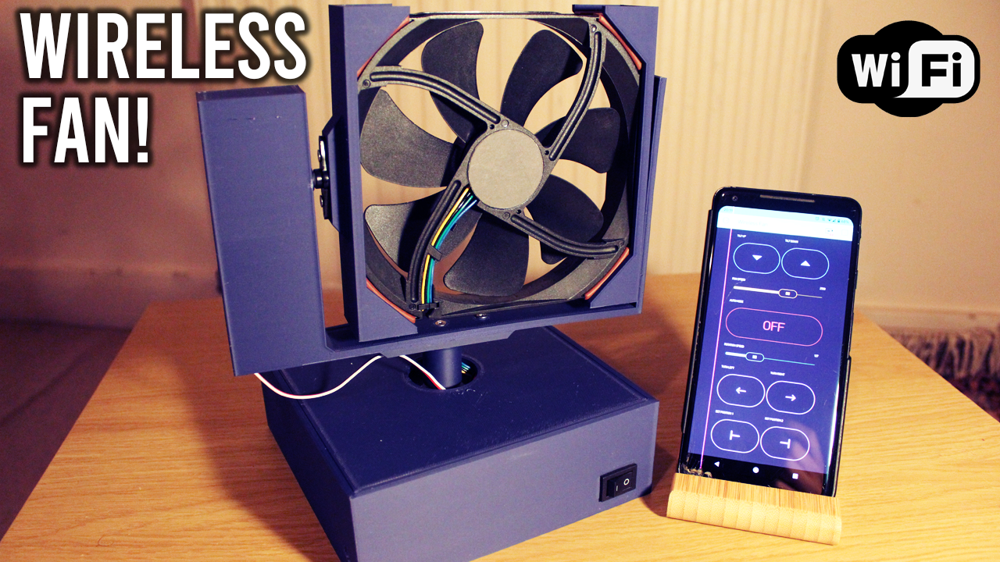
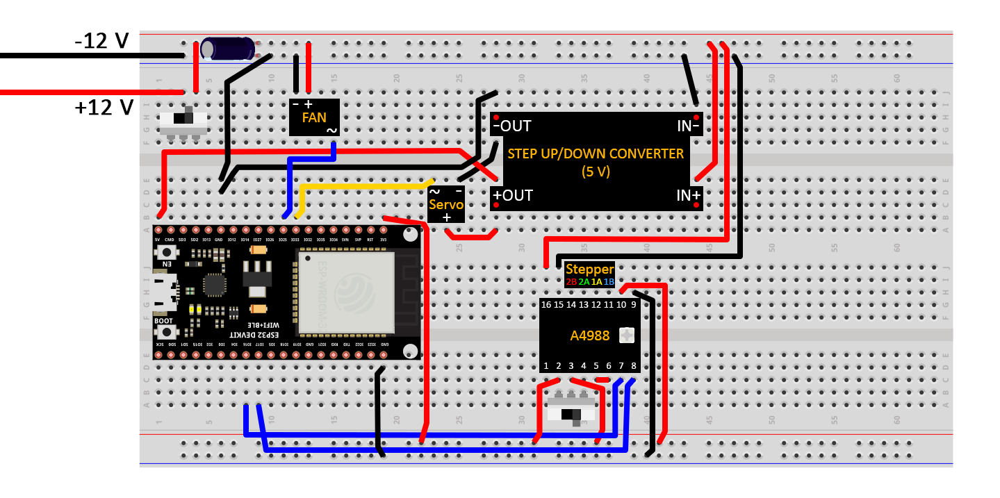
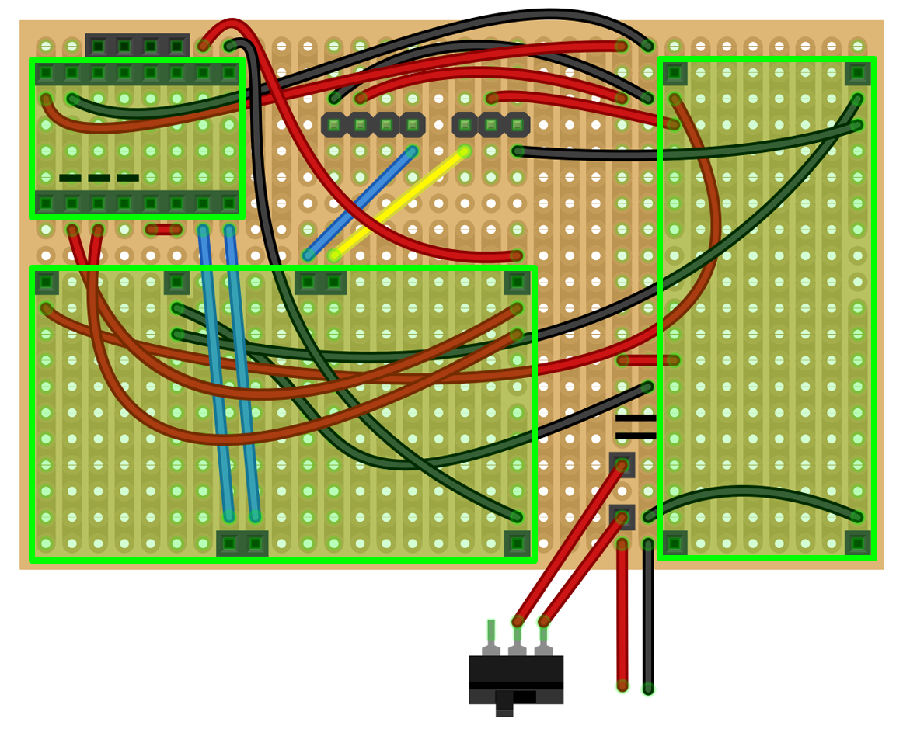

# Wireless Fan

## Description

An Arduino based wireless fan that is controlled from your phone using the ESP32 micro-controller and the Blynk app.

There is a [video](https://youtu.be/TYE_MnvAZrU) associated with this repository/project, I highly recommend you watch it before using this repo.

## How to use

### Libraries needed

All these libraries can be easily installed using the Arduino IDE library manager.

- `Blynk` by Volodymyr Shymanskyy.
- `ESP32Servo` by Kevin Harrington and John K. Bennett.

### Arduino

- In the `/WirelessFan` directory is the Arduino sketch.
- There are 3 variables that you need to change in the sketch:
    - `auth` which is the Blynk authentication code that you receive by email when you create the project on the Blynk app on the phone.
    - `ssid` your WiFi name.
    - `pass` your WiFi password.
- Once you have made these changes, upload the sketch to the ESP32.

### Components

- Noctua NF-A14 fan.
- Nema 17 stepper motor, for the rotation.
- A4988 stepper motor driver, to control the stepper motor.
- DS04-NFC servo motor, for the tilt.
- ESP32, as the micro-controller.
- 12v 5A power supply.
- 100uF capacitor, to filter the power spikes and keep voltage smooth.
- LM2596 buck converter, to convert 12v to 5v.

### Wiring

#### Breadboard version

#### Stripboard version

## 3D printing

For all the 3D printed parts, please refer to the `/3d_models` directory.
